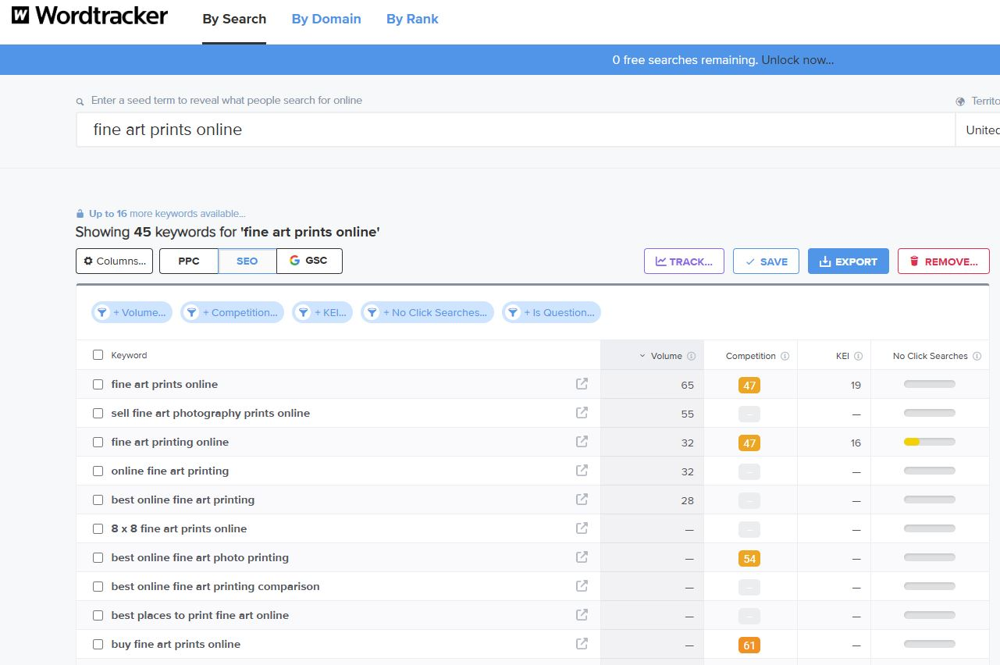
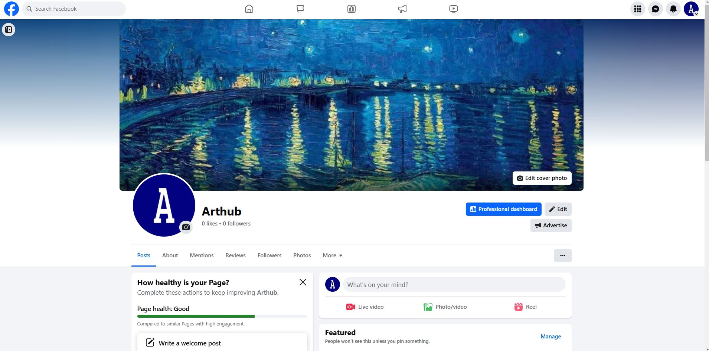
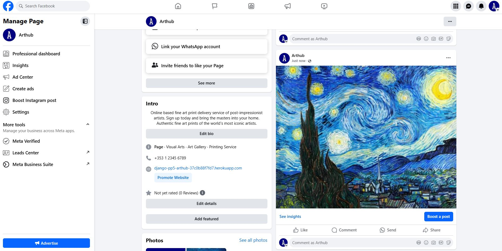

<h1 align="center">Arthub</h1>
<div align="center"></div>

Arthub is a fully functioning e-commerce web application. It sells premium fine art prints of iconic post-impressionist artists including Vincent Van Gogh, Paul Cézanne, Georges Seurat, Paul Gauguin, and Henri Toulouse-Lautrec. Discover high-quality reproductions of famous masterpieces like 'Starry Night', 'Sunflowers', and 'The Bedroom'. Perfect for collectors and art lovers looking to decorate their homes with timeless art. The site allows users to view and purchase post impressionist fine art prints online. Users can easily create personal accounts and profiles and see information on the site, and the prints themselves. The site also enables administrators to add, edit and remove products, as well as view and respond to contact enquiries.
         
View the live project [here.](https://django-pp5-arthub-37c0b88f7fd7.herokuapp.com/)


## User Experience (UX)

The design philosophy was to create a an engaging look, while keeping relevant information presented in a salient and clean manner, allowing the user to easily and pleasingly navigate through the site.
  
### Colour Scheme


I used [coolors.co](https://coolors.co/) to generate my colour palette.


### Typography

The fonts in the theme are aimed to be simple and not to distract the user, and reinforce the idea of a modern ecommerce online store that sell fine art prints.

- [Playfair Display](https://fonts.google.com/specimen/Playfair+Display?query=Playfair) was used for the primary headers and titles and text.

- [Font Awesome](https://fontawesome.com) icons were used throughout the site.

## User Stories

All user stories can be found in a linked GitHub project [here](https://github.com/users/gbroder24/projects/6)

## Wireframes

Several wireframes were created to assist with the design. They are based loosely from the Boutique Ado walkthrough and the Web Piano Academy. Wireframes can be viewed [here](documentation/wireframes).

## Database Schema 

While planning this project, I drew up an Entity Relationship Diagram to help me to visualise the database models and their relationships. The database design schema can be viewed [here](documentation/db_schema/entity-rel-diag.JPG). 

This Entity Relationship Diagram(ERD) demonstrates how each feature interacts with each other and the connected PostgreSQL Database. Using Django's User Model, and Django AllAuth to carry out all user authentication, a user_id is created when the user registers with their username and password, email. This allows the user to have full CRUD functionality for the online store.

The User Profile, Order, Category, Product and Order Line Item Models was inspired by the e-commerce walkthrough project Boutique Ado by the Code Institute during my learning of Django. It helped me to get a good and secure grasp of the templating structure and connected Python files.

My Contact model represents a contact request form, where users can submit inquiries with details like name, email, subject, and message. The model includes predefined subject choices, such as "Order Inquiry" and "Custom Art Requests," and tracks when the request was created and whether it has been responded to. The __str__ method returns the user's email as a string representation of the model.

My Faq model stores frequently asked questions, with fields for the question and its corresponding answer. The __str__ method returns the question as the string representation of the model.

My Email model stores unique email addresses, ensuring no duplicates. It includes a custom error message for duplicate entries and has a __str__ method that returns the email. The get_absolute_url method returns the URL for the homepage.

Through the Admin Django Dashboard, the connected user_id to all data entered to the site means that the Admin Staff can remove a User and their data completely through the additon of on_delete=models.CASCADE.


## Project Planning  
 
-   ### Strategy Plane

    - The project goal was to build an e-commerce app online store that specialises in selling fine art prints of post impressionist artists where the user (customer) could have full CRUD functionality for creating an account, purchasing multiple products, updating their personal information and subscribing to a newsletter. 

      -   #### Site Goals

          - Sell high-quality fine art prints of post-impressionist artists.
          - Plenty of clean space to keep it fresh and to-the-point.
          - Commonly-used, identifiable icons with some redesigns to fit the theme.
          - Easy UI for quick fulfillment of feature CRUD functionalities.
          - UX remains the same whether on mobile, tablet or desktop.
          - Scalable idea, for addition of future features to easily grow the business.
          - Ensure a smooth, secure shopping experience with easy navigation and payment options.
          - Promote art appreciation and foster a community of art enthusiasts.

-   ### Agile methodology
    - The principles of agile methodology were utilized during the project. By assigning user stories to issues and taking advantage of the GitHub Kanban board functionality, the necessary goals and priorities throughout the project could be well defined. In addition, labels were used to further define the priority of each user story in the Kanban board.  

      -  #### MoSCoW Prioritization

            - I chose to follow the MoSCoW Prioritization method for Arthub, identifying and labelling my:

              - **Must Haves**: the 'required', critical components of the project. Completing my 'Must Haves' helped me to reach the MVP (Minimum Viable Product) for this project early, allowing me to develop the project further than originally planned.
                
              - **Should Haves**: the components that are valuable to the project but not absolutely 'vital' at the MVP stage. The 'Must Haves' must receive priority over the 'Should Haves'.
              - **Could Haves**: these are the features that are a 'bonus' to the project, it would be nice to have them in this phase, but only if the most important issues have been completed first and time allows.
              - **Won't Haves**: the features or components that either no longer fit the project's brief or are of very low priority for this release. 

-   ### Security
    - A number of security steps were taken in this project in order to protect the user's submitted data. Arthub allows the user to become part of the community and avail of it's online purchasing of products and subscribing to a newsletter. To meet the strict internet standards of protecting a user's data, the following processes were included in the project's development.

      - #### AllAuth 

          - Django AllAuth is an installable framework that takes care of the user registration and authentication process. Authentication was needed to determine when a user was registered or unregistered and it controlled what content was accessible on Arthub. The setup of AllAuth included:

            - installing it to my workspace dependencies
            - adding it to my INSTALLED_APPS in my settings.py
            - sourcing the AUTHENTICATION_BACKENDS from the AllAuth docs for my settings.py
            - adding its URL to my projects 'urls.py'
            - run database migrations to create the tables needed for AllAuth
  
      - #### Defensive Design  

          - Arthub was developed to ensure a smooth user experience, to the best of my current learning experience with Django. 

            - Input validation and error messages provide feedback to the user to guide them towards the desired outcome. 
            - Unregistered users can Sign Up through a link. 
            - Unregistered users are restricted from viewing what a registered user can view such as personal information and order history.
            - Authentication processes of control edit/delete icons to reveal them to the authorised user only. 
            - Deletion of data is confirmed through an additional modal, double-checking with the user.
            - Testing and validation of features completes the process.

      -   #### CSRF Tokens

          - CSRF (Cross-Site Request Forgery) tokens are included in every form to help authenticate the request with the server when the form is submitted. Absence of these tokens can leave a site vulnerable to attackers who may steal a users data.

## Ecommerce Business Model

This site sells goods to individual customers, and therefore follows a `Business to Customer` model.
It is of the simplest **B2C** forms, as it focuses on individual transactions, and doesn't need anything
such as monthly/annual subscriptions.

It is still in its early development stages, although it already has a newsletter system, it needs links for social media marketing.

Social media can potentially build a community of users around the business, and boost site visitor numbers,
especially when using larger platforms such as Facebook.

A newsletter list can be used by the business to send regular messages to site users.
For example, what items are on special offer, new items in stock,
updates to business hours, notifications of events, and much more!

## Search Engine Optimization (SEO) & Social Media Marketing

### Keywords

I've identified some appropriate keywords to align with my site, that should help users
when searching online to find my page easily from a search engine.
This included a series of the following keyword types

- Short-tail (head terms) keywords
- Long-tail keywords

I also played around with [Word Tracker](https://www.wordtracker.com) a bit
to check the frequency of some of my site's primary keywords (only until the free trial expired).

- 

### Sitemap

[XML-Sitemaps](https://www.xml-sitemaps.com) was used to generate a sitemap.xml file.

After it finished crawling the entire site, it created a
[sitemap.xml](sitemap.xml) which I've downloaded and included in the repository.

### Robots

I've created the [robots.txt](robots.txt) file at the root-level.
Inside, I've included the default settings:

```
User-agent: *
Disallow:
Sitemap: https://django-pp5-arthub-37c0b88f7fd7.herokuapp.com/sitemap.xml
```

Further links for future implementation:
- [Google search console](https://search.google.com/search-console)
- [Creating and submitting a sitemap](https://developers.google.com/search/docs/advanced/sitemaps/build-sitemap)
- [Managing your sitemaps and using sitemaps reports](https://support.google.com/webmasters/answer/7451001)
- [Testing the robots.txt file](https://support.google.com/webmasters/answer/6062598)

### Social Media Marketing

Creating a strong social base (with participation) and linking that to the business site can help drive sales.
Using more popular providers with a wider user base, such as Facebook, typically maximizes site views.

I've created a mockup Facebook business account using the
[Balsamiq template](https://code-institute-org.github.io/5P-Assessments-Handbook/files/Facebook_Mockups.zip)
provided by Code Institute.





### Newsletter Marketing

I have incorporated a newsletter sign-up form on my application, to allow users to supply their
email address if they are interested in learning more. 

Users can also unsubscribe from the newsletter by following the link in their subscription confirmation email.
  

## Features  


### Future Features

- Subscription Payments
    - Possible subscription payment model which would include access to all prints for a recurring fee. Could implement this via django groups with subscriber accounts given privileges to view subscriber-only areas of the site. Would also need to implement this in the stripe backend and update webhooks.
- Newsletter Template and Front-End Customisation
    - A system in which an admin could easily customise and send out a newsletter to all subscribers. Would need a front-end form which could take text & images, and would need to add the functionality into the newsletter views.

## Technologies and Languages Used

- [ HTML5 ](https://developer.mozilla.org/en-US/docs/Glossary/HTML5).
- [ CSS3 ](https://www.geeksforgeeks.org/difference-between-css-and-css3/).
- [ Javascript ES6 ](https://www.w3schools.com/js/js_es6.asp).
- [ Python3 ](https://www.python.org/download/releases/3.0/). 
- [ Django ](https://www.djangoproject.com/) was used as the Python framework for the site. 
- [ MarkDown ](https://github.com/luong-komorebi/Markdown-Tutorial/blob/master/README.md) Readme.md file.  
- [ Github ](https://github.com/about) Repository.  
- [ Gitpod ](https://www.gitpod.io/about) IDE.  
- [ Git ](https://git-scm.com/about) Version control.  
- [ W3schools ](https://www.w3schools.com/) HTML, CSS, Python tips.  
- [Stripe](https://stripe.com) used for online secure payments of ecommerce products/services.
- [AWS S3](https://aws.amazon.com/s3) used for online static file storage.
- [ ElephantSQL ](https://www.elephantsql.com/) was used to host the PostgreSQL database needed to collect and recall the users data.
- [ MarkUp Validation ](https://validator.w3.org/#validate_by_uri) to validate html code to standard.
- [ CSS Validation ](https://jigsaw.w3.org/css-validator/) to validate css code to standard.
- [ Javascript Validation ](https://jshint.com/) to validate javascript code to standard.
- [ CI Python Linter ](https://pep8ci.herokuapp.com/#) to validate code to PEP8 standard.  
- [ Heroku ](https://id.heroku.com/) to deploy the application.      

## Frameworks and Libraries Used

asgiref==3.8.1  
boto3==1.36.22  
botocore==1.36.22  
certifi==2025.1.31  
cffi==1.17.1  
charset-normalizer==3.4.1  
cryptography==44.0.0  
defusedxml==0.7.1  
dj-database-url==0.5.0  
Django==4.2  
django-allauth==0.61.0  
django-countries==7.6.1  
django-crispy-forms==1.14.0  
django-storages==1.14.5  
flake8==7.1.2  
gunicorn==23.0.0  
idna==3.10  
jmespath==1.0.1  
mccabe==0.7.0  
oauthlib==3.2.2  
packaging==24.2  
pillow==11.1.0  
psycopg2==2.9.10  
pycodestyle==2.12.1  
pycparser==2.22  
pyflakes==3.2.0  
PyJWT==2.10.1  
python-dateutil==2.9.0.post0  
python3-openid==3.2.0  
pytz==2025.1  
requests==2.32.3  
requests-oauthlib==2.0.0  
s3transfer==0.11.2  
setuptools==75.8.0  
six==1.17.0  
sqlparse==0.5.3  
stripe==11.5.0  
typing_extensions==4.12.2  
tzdata==2025.1  
urllib3==2.3.0  


## Programs & Tools

- [ Google Fonts ](https://fonts.google.com/)to incorporate font styles.  
- [ Bootstrap ](https://getbootstrap.com/) to create the front-end design.
- [ Balsamiq ](https://balsamiq.com/) to create wireframes
- [ Cloud Convert ](https://cloudconvert.com/) to convert images
- [ Image Resizer ](https://imageresizer.com/) to resize images
- [ Coolers ](https://coolors.co/) to create colour palette
- [ Lucidchart ](https://www.lucidchart.com/pages/) was used to create the database schema.
- [ Favicon ](https://favicon.io/) to create the logo.
- [ Am I Responsive ](https://ui.dev/amiresponsive) to create the mockup.
- [ Cloud Convert ](https://cloudconvert.com/jpg-to-webp) to convert images to webp.
- [ Diff Checker ](https://www.diffchecker.com/) to compare code.
- [ Croppola ](https://croppola.com/) to crop images.
- [ Temp Mail ](https://internxt.com/temporary-email) to recieve emails.
- [ Google Mail ](https://accounts.google.com/signup) to send emails.
 

## Testing  

Test scenarios for the Failte Bistro application were created by the Junior Full Stack Software Developer (Gary Broderick). User testing (by family and friends) was also executed. Automated testing was used during the final development phase of the project. For all testing, please refer to the [TESTING.md](TESTING.md) file.

## Deployment

### Set up with VS Code on Windows  

#### Open and the Command Prompt  

1. Press Windows + R on your keyboard.  
2. Type cmd and hit Enter.  
3. A black window with a blinking cursor will appear—this is the Command Prompt.  
4. In the Command Prompt, type echo Hello, world!  
5. Press Enter. You should see Hello, world! in the command prompt. Your command prompt is working.  

#### Check if Python is Already Installed  

1. In the Command Prompt, type python3 --version.  
2. If this returns an error, try python --version.  
3. If, after trying both commands, you see an error, e.g. "Python was not found;", or a version of Python that is not 3.12.x, follow the steps below to install the correct version for the programme.  
4. If you already have Python 3.12.x installed, you already have the correct version of Python installed. Proceed to Installing Git.  

#### Install Python  

1. Paste this link into your browser: https://www.python.org/ftp/python/3.12.8/python-3.12.8-amd64.exe.  
2. It will download the Python Installer file  
3. Open the downloaded file from your Downloads folder.  
4. In the installer Important: Check the box that says 'Add Python to PATH' Click Install Now.   
5. Once the installation finishes, click Disable path length limit if prompted.  
6. Restart your computer if prompted.  

#### Verify Python Installation  

1. Important: Close your Command Prompt if you still have it open, then reopen a new one using Win+R.  
2. In the Command Prompt, type: python3 --version pip3 --version
3. If both commands return version number 3.12, Python is ready to use!  
4. If python3 command returns an error, please also try: python --version  

#### Install Git

1. Check Git Installation. n the Command Prompt, type: git --version  
2. If you see something like git version 2.x.x, Git is already installed, proceed  to Installing VS Code.  
3. If you see an error, e.g. 'git' is not recognised, follow the steps below.  

#### Identify your Windows system type

1. Press Win + R.  
2. Open the System Information Window by typing msinfo32, and hit Enter.  
3. In the System Information window, look for System Type:  x64-based PC means 64-bit. x86-based PC means 32-bit.  

#### Download and install Git

1. Go to https://git-scm.com/downloads/win in your browser. If you have a 64 bit system, click the Click here to download link just under the Download for Windows heading. If you have a 32 bit system, click the 32-bit Git for Windows Setup link under the Standalone Installer heading.  
2. Open the downloaded file from your Downloads folder.  
3. Follow the installation steps. Keep all the default options unless you know specific changes are needed. Ensure that on the 'Adjusting your PATH environment' screen the option Git from the command line and also from 3-rd party software should be selected. On the 'Configuring the line ending conversions' screen, the option Checkout Windows-style, commit Unix-style line endings should be selected.  
4. Keep the rest options at default and then Finish to complete the installation  
5. A browser window for Git Release Notes might have opened for you, you may close it if you wish.  

#### Verify Git Installation

1. Important: Close your Command Prompt if you still have it open, then reopen a new one using Win+R  
2. In the Command Prompt, type: git --version You should see a version number, confirming Git is installed  

#### Setup Git

1. In the Command Prompt, set up your name and email: git config --global user.name "YourGitHubUsername". Replace "YourGitHubUsername" with your GitHub username. git config --global user.email "your.email@example.com". Replace  "your.email@example.com" with the email address you registered with GitHub.  
2. Verify your setup git config --list If you see your name and email listed, you are all set. If you see the wrong email address, repeat step b with the correct email address.  

#### Install Visual Studio Code (VS Code)

1. Check if VS Code is already installed. Press Windows + S and type Visual Studio Code, and press Enter.  
2. If VS Code opens, it's already installed, you are all set.  
3. If not, follow the steps below.  

#### Install VS Code

1. Go to https://code.visualstudio.com/download in your browser.  
2. Click the Download for Windows button.  
3. Open the downloaded file from your Downloads folder.  
4. Follow the installation steps. On the 'Select Additional Tasks' screen Check the Add 'Open with Code' action to Windows Explorer file context menu. Click Next, then  Install and wait for it to finish.  

#### Verify VS Code installation

1. In the Command Prompt, type code --version If you see a version number, VS Code is ready to use. To ensure all required settings are enabled, restart your machine.  

#### Install extensions

1. While in VS Code, navigate to the Extensions Marketplace in the left bar.  
2. Use the search bar in the extensions section to search for and install the following extensions Prettier, Python, Flake8, Bootstrap 4 CDN Snippet, Auto Open Preview Panel.  

#### Create a folder for your projects

1. Open your file manager.  
2. Select a preferred location (i.e. Documents), create a new folder in your folder structure and name it vscode-projects.  

Congratulations! You are now ready to continue on working in VS Code. Happy coding!

### Remote

This website was deployed using GitHub pages. The steps to deploy are as follows:

1. Login to GitHub and navigate to the repository page (arthub), click on the repository.
2. Once inside the repository, click on the "Settings" tab above the repository title.
3. Under "Code and automation" select "Pages" tab on the left side navigation menu.
4. In the "Build and Deployment" section (middle of the screen), under "Source" select from the drop-down menu "Deploy from a branch".
5. Under "Branch", select "main" branch and then "root" folder and click "save" button
6. The GitHub page site will be deployed.

It might take a few minutes to generate the "live" website link.

The live link to the website can be found here: [ Arthub ](https://django-pp5-arthub-37c0b88f7fd7.herokuapp.com/).

### Local Deployment

This project can be cloned or forked in order to make a local copy on your own system.

For either method, you will need to install any applicable packages found within the *requirements.txt* file.

- `pip3 install -r requirements.txt`.

You will need to create a new file called `env.py` at the root-level,
and include the same environment variables listed above from the Heroku deployment steps.

Sample `env.py` file:

```python
import os

os.environ.setdefault("AWS_ACCESS_KEY_ID", "user's own value")
os.environ.setdefault("AWS_SECRET_ACCESS_KEY", "user's own value")
os.environ.setdefault("DATABASE_URL", "user's own value")
os.environ.setdefault("EMAIL_HOST_PASS", "user's own value")
os.environ.setdefault("EMAIL_HOST_USER", "user's own value")
os.environ.setdefault("SECRET_KEY", "user's own value")
os.environ.setdefault("STRIPE_PUBLIC_KEY", "user's own value")
os.environ.setdefault("STRIPE_SECRET_KEY", "user's own value")
os.environ.setdefault("STRIPE_WH_SECRET", "user's own value")

# local environment only (do not include these in production/deployment!)
os.environ.setdefault("DEVELOPMENT", "1")
```

Once the project is cloned or forked, in order to run it locally, you'll need to follow these steps:

- Start the Django app: `python3 manage.py runserver`
- Stop the app once it's loaded: `CTRL+C` or `⌘+C` (Mac)
- Make any necessary migrations: `python3 manage.py makemigrations`
- Migrate the data to the database: `python3 manage.py migrate`
- Create a superuser: `python3 manage.py createsuperuser`
- Load fixtures (if applicable): `python3 manage.py loaddata file-name.json` (repeat for each file)
- Everything should be ready now, so run the Django app again: `python3 manage.py runserver`

If you'd like to backup your database models, use the following command for each model you'd like to create a fixture for:

- `python3 manage.py dumpdata your-model > your-model.json`
- *repeat this action for each model you wish to backup*

### Heroku Deployment

1. Navigate to your Heroku dashboard and create a new app with a unique name.  
2. Click on the Settings tab and reveal the config vars and set your environment variables:

    | Key | Value |
    | --- | --- |
    | `AWS_ACCESS_KEY_ID` | user's own value |
    | `AWS_SECRET_ACCESS_KEY` | user's own value |
    | `DATABASE_URL` | user's own value |
    | `DISABLE_COLLECTSTATIC` | 1 (*this is temporary, and can be removed for the final deployment*) |
    | `EMAIL_HOST_PASS` | user's own value |
    | `EMAIL_HOST_USER` | user's own value |
    | `SECRET_KEY` | user's own value |
    | `STRIPE_PUBLIC_KEY` | user's own value |
    | `STRIPE_SECRET_KEY` | user's own value |
    | `STRIPE_WH_SECRET` | user's own value |
    | `USE_AWS` | True |

    `DISABLE_COLLECTSTATIC` and a value of `1` prevents Heroku from uploading static files, such as CSS and JS, during the build.  
3. Install a production-ready webserver for Heroku `pip3 install gunicorn~=20.1`.  
Add `gunicorn==20.1.0` to the requirements.txt file with:  
`pip3 freeze --local > requirements.txt`  
Note: gunicorn is a production equivalent of the `manage.py runserver` used in development but with speed and security optimisation.  
4. Create a file named Procfile at the root directory of the project (same directory as requirements.txt).  
Note: The Procfile has no file extension.  
5. In the Procfile, declare this is a web process followed by the command to execute your Django project.  
`web: gunicorn my_project.wsgi` This assumes your project is named my_project. Note the space after the colon.  
Note: `gunicorn my_project.wsgi` is the command heroku will use to start the server. It works similarly to `python3 manage.py runserver`.
6. Open the my_project/settings.py file and replace `DEBUG=True` with `DEBUG=False`.  
Note the comment regarding security in production.  
7. Also, in settings.py we need to append the Heroku hostname to the `ALLOWED_HOSTS` list, in addition to the local host we added in the last lesson.  
`,'.herokuapp.com'`  
Note: Remember the comma and the dot before `herokuapp`.  
8. You can now git add the files you have modified, git commit them and push them to GitHub.  
9. Now return to the Heroku dashboard, and in your app, click on the Deploy tab.  
10. In the Deployment method section enable GitHub integration by clicking on Connect to GitHub.  
If you have not deployed a project from GitHub before then, you will be asked to authenticate with GitHub.  
11. Start typing your project repo name into the search box and click Search. A list of repositories from your GitHub account should appear. Click on the GitHub repo you want to deploy from.  
12. Scroll to the bottom of the page and click Deploy Branch to start a manual deployment of the main branch.  
You can view the build output in the application's Activity tab in the dashboard.  
13. Click on Open app to view your deployed project.    
14. Open the Resources tab and choose an eco dyno. This dyno is a lightweight container to run your project.  
15. Open the Resources tab and verify there is no existing Postgres database add-on. If there is one you can destroy it.  
16. Click on Open app to view your deployed project.  

### PostgreSQL

1. Navigate to PostgreSQL from Code Institute.  
2. Enter your student email address in the input field provided.  
3. Click Submit.  
4. Wait while the database is created.  
5. Your database is successfully created! Please review the email sent to your student email inbox.  
6. Return to your workspace and open the codestar/settings.py file. Change the value of `DEBUG` back to True as this will ensure that you get detailed errors to ease debugging during development.  
7. Create a file named env.py at the top level of the project. You can either create a new file in the file structure or use the terminal command as shown.  
8. Open the .gitignore file and add env.py to prevent the secret data you will add to it from being pushed to GitHub.  
Note: If you have used a codeinstitute template then it will be there already.  
9. In your newly created env.py file, import Python's operating system module and use it to set the value of the DATABASE_URL constant to the URL in the email you received from PostgreSQL from Code Institute.  
`import os`  
`os.environ.setdefault(
    "DATABASE_URL", "<your-database-URL>")`  
Note: Remember the quotes around the constant and your URL as the `setdefault()` method expects string values as parameters.  
10. Pip install the two packages required to connect to your PostgreSQL database. Then add them to the requirements file:  
pip3 install dj-database-url~=0.5 psycopg2~=2.9  
pip3 freeze --local > requirements.txt  
Note: `psycopg2` is a driver for interacting with PostgreSQL databases using Python. The `dj-database-url` Python package is a utility to connect Django to a database using a URL.  
11. In codestar/settings.py, import the appropriate packages (Note: You will use dj_database_url in a later step). Now we connect the settings.py file to the env.py file:  
`import os`  
`import dj_database_url`  
`if os.path.isfile('env.py'):`  
  `import env`  
12. Next in the settings.py file, we need to comment out the local sqlite3 database connection.  
Note: Django provides this local sqlite3 database by default for development, but we are going to go with a production-ready PostgreSQL cloud database instead.  
13. Then, in the settings.py file, connect to the environment variable DATABASE_URL you previously added to the env.py file:  
`DATABASES = {
    'default': dj_database_url.parse(os.environ.get("DATABASE_URL"))
}`  
14. Now that your project is connected to the database, you can create database tables with Django's migrate command:  
`python3 manage.py migrate`  
Note: These tables are for data generated by the existing apps built into Django.  
15. Let's enter our first data into the database. As Django comes with built-in auth and admin apps we can create a superuser with admin access to our database:  
`python3 manage.py createsuperuser`  
Choose a memorable user name, use your email address and choose a secure password.  
Note: Django will check your password security.  
16. Click on Reveal Config Vars in the Settings tab.  
17. Add a new config var with a key of DATABASE_URL and the value of the PostgreSQL from Code Institute URL.  
Note: You can copy this from your env.py file (minus the quotes) or the email you received from PostgreSQL from Code Institute.  
18. Now your deployed app is connected to your PostgreSQL cloud database.

### Amazon AWS

This project uses [AWS](https://aws.amazon.com) to store media and static files online, due to the fact that Heroku doesn't persist this type of data.

Once you've created an AWS account and logged-in, follow these series of steps to get your project connected.
Make sure you're on the **AWS Management Console** page.

#### S3 Bucket

- Search for **S3**.
- Create a new bucket, give it a name (matching your Heroku app name), and choose the region closest to you.
- Uncheck **Block all public access**, and acknowledge that the bucket will be public (required for it to work on Heroku).
- From **Object Ownership**, make sure to have **ACLs enabled**, and **Bucket owner preferred** selected.
- From the **Properties** tab, turn on static website hosting, and type `index.html` and `error.html` in their respective fields, then click **Save**.
- From the **Permissions** tab, paste in the following CORS configuration:

	```shell
	[
		{
			"AllowedHeaders": [
				"Authorization"
			],
			"AllowedMethods": [
				"GET"
			],
			"AllowedOrigins": [
				"*"
			],
			"ExposeHeaders": []
		}
	]
	```

- Copy your **ARN** string.
- From the **Bucket Policy** tab, select the **Policy Generator** link, and use the following steps:
	- Policy Type: **S3 Bucket Policy**
	- Effect: **Allow**
	- Principal: `*`
	- Actions: **GetObject**
	- Amazon Resource Name (ARN): **paste-your-ARN-here**
	- Click **Add Statement**
	- Click **Generate Policy**
	- Copy the entire Policy, and paste it into the **Bucket Policy Editor**

		```shell
		{
			"Id": "Policy1234567890",
			"Version": "2012-10-17",
			"Statement": [
				{
					"Sid": "Stmt1234567890",
					"Action": [
						"s3:GetObject"
					],
					"Effect": "Allow",
					"Resource": "arn:aws:s3:::your-bucket-name/*"
					"Principal": "*",
				}
			]
		}
		```

	- Before you click "Save", add `/*` to the end of the Resource key in the Bucket Policy Editor (like above).
	- Click **Save**.
- From the **Access Control List (ACL)** section, click "Edit" and enable **List** for **Everyone (public access)**, and accept the warning box.
	- If the edit button is disabled, you need to change the **Object Ownership** section above to **ACLs enabled** (mentioned above).

#### IAM

Back on the AWS Services Menu, search for and open **IAM** (Identity and Access Management).
Once on the IAM page, follow these steps:

- From **User Groups**, click **Create New Group**.
	- Suggested Name: `manage-django-pp5-arthub-bucket` (group + the project name)
- Tags are optional, but you must click it to get to the **review policy** page.
- From **User Groups**, select your newly created group, and go to the **Permissions** tab.
- Open the **Add Permissions** dropdown, and click **Attach Policies**.
- Select the policy, then click **Add Permissions** at the bottom when finished.
- From the **JSON** tab, select the **Import Managed Policy** link.
	- Search for **S3**, select the `AmazonS3FullAccess` policy, and then **Import**.
	- You'll need your ARN from the S3 Bucket copied again, which is pasted into "Resources" key on the Policy.

		```shell
		{
			"Version": "2012-10-17",
			"Statement": [
				{
					"Effect": "Allow",
					"Action": "s3:*",
					"Resource": [
						"arn:aws:s3:::your-bucket-name",
						"arn:aws:s3:::your-bucket-name/*"
					]
				}
			]
		}
		```
	
	- Click **Review Policy**.
	- Suggested Name: `django-pp5-arthub-bucket-policy` (policy + the project name)
	- Provide a description:
		- "Access to S3 Bucket for arthub static files."
	- Click **Create Policy**.
- From **User Groups**, click your "manage-django-pp5-arthub-bucket".
- Click **Attach Policy**.
- Search for the policy you've just created ("django-pp5-arthub-bucket-policy") and select it, then **Attach Policy**.
- From **User Groups**, click **Add User**.
	- Suggested Name: `django-pp5-arthub-user` (user + the project name)
- For "Select AWS Access Type", select **Programmatic Access**.
- Select the group to add your new user to: `manage-django-pp5-arthub-bucket`
- Tags are optional, but you must click it to get to the **review user** page.
- Click **Create User** once done.
- You should see a button to **Download .csv**, so click it to save a copy on your system.
	- **IMPORTANT**: once you pass this page, you cannot come back to download it again, so do it immediately!
	- This contains the user's **Access key ID** and **Secret access key**.
	- `AWS_ACCESS_KEY_ID` = **Access key ID**
	- `AWS_SECRET_ACCESS_KEY` = **Secret access key**

#### Final AWS Setup

- If Heroku Config Vars has `DISABLE_COLLECTSTATIC` still, this can be removed now, so that AWS will handle the static files.
- Back within **S3**, create a new folder called: `media`.
- Select any existing media images for your project to prepare them for being uploaded into the new folder.
- Under **Manage Public Permissions**, select **Grant public read access to this object(s)**.
- No further settings are required, so click **Upload**.

### Stripe API

This project uses [Stripe](https://stripe.com) to handle the ecommerce payments.

Once you've created a Stripe account and logged-in, follow these series of steps to get your project connected.

- From your Stripe dashboard, click to expand the "Get your test API keys".
- You'll have two keys here:
	- `STRIPE_PUBLIC_KEY` = Publishable Key (starts with **pk**)
	- `STRIPE_SECRET_KEY` = Secret Key (starts with **sk**)

As a backup, in case users prematurely close the purchase-order page during payment, we can include Stripe Webhooks.

- From your Stripe dashboard, click **Developers**, and select **Webhooks**.
- From there, click **Add Endpoint**.
	- `https://django-pp5-arthub-37c0b88f7fd7.herokuapp.com/checkout/wh/`
- Click **receive all events**.
- Click **Add Endpoint** to complete the process.
- You'll have a new key here:
	- `STRIPE_WH_SECRET` = Signing Secret (Wehbook) Key (starts with **wh**)

### Gmail API

This project uses [Gmail](https://mail.google.com) to handle sending emails to users for account verification and purchase order confirmations.

Once you've created a Gmail (Google) account and logged-in, follow these series of steps to get your project connected.

- Click on the **Account Settings** (cog icon) in the top-right corner of Gmail.
- Click on the **Accounts and Import** tab.
- Within the section called "Change account settings", click on the link for **Other Google Account settings**.
- From this new page, select **Security** on the left.
- Select **2-Step Verification** to turn it on. (verify your password and account)
- Once verified, select **Turn On** for 2FA.
- Navigate back to the **Security** page, and you'll see a new option called **App passwords**.
- This might prompt you once again to confirm your password and account.
- Select **Mail** for the app type.
- Select **Other (Custom name)** for the device type.
	- Any custom name, such as "Django" or arthub
- You'll be provided with a 16-character password (API key).
	- Save this somewhere locally, as you cannot access this key again later!
	- `EMAIL_HOST_PASS` = user's 16-character API key
	- `EMAIL_HOST_USER` = user's own personal Gmail email address

## Credits

### Code
  - [ The Bear ](https://github.com/JCav23/Project4-TheBear/) project.
  - [ Tribe ](https://github.com/adamgilroy22/tribe/) project.
  - [Django Documenation](https://www.djangoproject.com/) was used to provide examples of code solutions and Django functionality.
  - [Bootstrap Documenation](https://getbootstrap.com/) was used to provide examples of Bootstrap functionality and building blocks.
  - [Code Institute walkthrough](https://codeinstitute.net/) as inspiration and code examples, the code institute walkthroughs "Hello Django" and "I Think Therefore I Blog" was used.
  - [Stack Overflow](https://stackoverflow.com/) - Dozens of different pages were used to assist during development and debuging.

### Content
  - [ The Bear ](https://github.com/JCav23/Project4-TheBear/) project.
  - [ Tribe ](https://github.com/adamgilroy22/tribe/) project.
  - [ Free Fido ](https://github.com/amylour/FreeFido_v2/) project.
  - [ Matt The Thresher ](https://matts.ie/matts-tipperary/) restaurant.
  - [ Cornstore ](https://cornstorelimerick.ie/) restaurant.


### Media
  - All images sourced on - [ Pexels ](https://www.pexels.com/)


### Acknowledgements
  - My Code Institute Mentor Rory Patrick Sheridan for feedback and suggestions.
  - My Code Institute Cohort Facilitator Lewis Dillon for project ideas and information.
  - My family, who helped keep me motivated during this challenging and fun project.

[🔼 Back to top](#user-experience-ux)